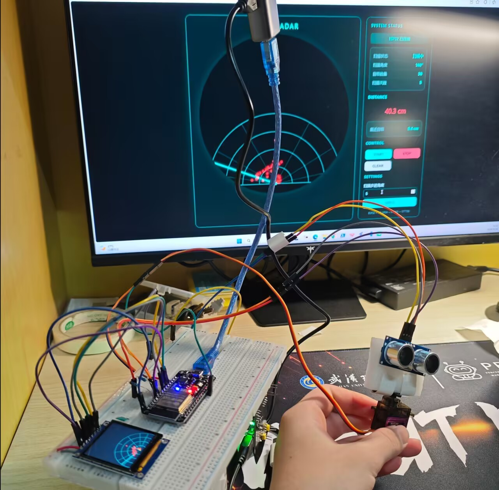

# ESP32 Wi-Fi Ultrasonic Radar
<p align="center">
  
</p>

基于 **ESP32 + MicroPython + MG90S + HC-SR04 + ST7789 TFT** 实现的无线超声波雷达系统。

系统通过 MG90S 舵机带动 HC-SR04 超声波传感器进行水平扫描，ESP32 在 ST7789 TFT 屏幕上实时绘制雷达界面，同时通过 Wi-Fi 与 PC 通信。

PC 端运行 Web Server，用户可以通过浏览器实时查看雷达数据，并控制雷达启动、停止、清屏以及扫描步进角度。


> [!IMPORTANT]
> 当前版本暂不支持离线模式。如果 ESP 未找到或无法连接预设的 Wi-Fi，会导致在烧录main文件后卡死！

---

## 1. 项目功能

本项目主要实现以下功能：

* [x] MG90S 舵机自动左右扫描
* [x] HC-SR04 超声波测距
* [x] ST7789 TFT 雷达动画显示
* [x] 雷达扫描线实时显示
* [x] 检测到障碍物时显示红色目标点
* [x] 一轮完整扫描结束后自动清除目标点
* [x] 雷达背景网格不会被扫描线擦除
* [x] ESP32 连接 Wi-Fi
* [x] ESP32 与 PC 通过 TCP 通信
* [x] PC 提供 Web 控制界面
* [x] 浏览器实时显示角度、距离和目标信息
* [x] Web 页面控制 START / STOP / CLEAR
* [x] Web 页面修改扫描步进角度
* [x] ESP32 端不再直接承担 HTTP Web Server，降低主循环负担

---

# 2. 系统架构

最终采用 **PC Web Server + ESP32 TCP Server** 的架构。

```text
                         Wi-Fi
              ┌────────────────────────┐
              │                        │
              ▼                        │
       ┌──────────────┐                │
       │ PC Browser   │                │
       │  Radar UI    │                │
       └──────┬───────┘                │
              │ HTTP                   │
              ▼                        │
       ┌──────────────┐                │
       │ PC server.py │                │
       │ HTTP Server  │                │
       └──────┬───────┘                │
              │ TCP :8888              │
              ▼                        │
       ┌─────────────────────┐         │
       │        ESP32        │         │
       │                     │         │
       │    radar.py         │         │
       │        │            │         │
       │   ┌────┴────┐       │         │
       │   ▼         ▼       │         │
       │ MG90S     HC-SR04   │         │
       │             │       │         │
       │             ▼       │         │
       │          Radar      │         │
       │             │       │         │
       │             ▼       │         │
       │         ST7789 TFT  │         │
       └─────────────────────┘         │
```

### ESP32 负责

* 舵机控制
* 超声波测距
* 雷达扫描逻辑
* TFT 显示
* Wi-Fi
* TCP 数据通信

### PC 负责

* HTTP Web Server
* 浏览器页面
* 雷达数据展示
* 用户控制命令
* 与 ESP32 建立 TCP 连接

这种架构避免了浏览器频繁请求 ESP32 HTTP 接口，从而降低 MicroPython 主循环的阻塞风险。

---

# 3. 项目目录

推荐最终目录结构：

```text
RadarProject/
│
├── ESP32/
│   ├── main.py
│   ├── config.py
│   ├── radar.py
│   ├── servo.py
│   ├── hcsr04.py
│   ├── st7789.py
│   └── tcp_server.py
│
└── PC/
    ├── server.py
    └── index.html
```

---

# 4. 硬件清单

| 硬件               | 数量 | 作用              |
| ---------------- | -: | --------------- |
| ESP32-WROOM-32   |  1 | 主控制器            |
| MG90S 舵机         |  1 | 带动传感器旋转         |
| HC-SR04          |  1 | 超声波测距           |
| ST7789 1.54" TFT |  1 | 雷达显示            |
| 1kΩ 电阻           |  1 | HC-SR04 ECHO 分压 |
| 2kΩ 电阻           |  1 | HC-SR04 ECHO 分压 |
| 5V 电源            |  1 | 舵机/HC-SR04 供电   |
| 杜邦线              | 若干 | 接线              |

---

# 5. 硬件接线

## 5.1 MG90S

```text
MG90S
────────────────
Signal  → ESP32 GPIO13
VCC     → 外部 5V
GND     → GND
```

注意：

**舵机使用外部 5V 供电时，必须与 ESP32 共地。**

```text
外部 5V GND
      │
      ├──── MG90S GND
      │
      └──── ESP32 GND
```

---

# 6. HC-SR04 接线

```text
HC-SR04
────────────────
VCC   → 5V
GND   → GND
TRIG  → GPIO5
ECHO  → GPIO19
```

### ECHO 必须进行电平转换

HC-SR04 的 ECHO 输出为 5V 电平，而 ESP32 GPIO 不能直接长期承受 5V。

使用 1kΩ + 2kΩ 电阻进行分压：

```text
HC-SR04 ECHO
      │
     1kΩ
      │
      ├──────── GPIO19
      │
     2kΩ
      │
     GND
```

分压后的电压约为：

```text
5V × 2kΩ / (1kΩ + 2kΩ)
≈ 3.33V
```

可以降低到 ESP32 GPIO19 可接受的电平范围。

---

# 7. ST7789 接线

当前使用的 SPI 接线：

```text
ST7789
────────────────────
GND → GND
VCC → 3.3V
SCL → GPIO18
SDA → GPIO23
RST → GPIO4
DC  → GPIO2
CS  → GPIO15
BL  → 3.3V
```

对应关系：

| ST7789 | ESP32  |
| ------ | ------ |
| GND    | GND    |
| VCC    | 3.3V   |
| SCL    | GPIO18 |
| SDA    | GPIO23 |
| RST    | GPIO4  |
| DC     | GPIO2  |
| CS     | GPIO15 |
| BL     | 3.3V   |

屏幕分辨率：

```text
240 × 240
```

---

# 8. 软件环境

## ESP32

使用：

```text
MicroPython
```

当前测试版本：

```text
MicroPython v1.29.0
Generic ESP32
```

开发环境：

```text
VS Code
```

通过 MicroPython/RT-Thread 相关工具连接 ESP32。

当前设备串口示例：

```text
COM5
```

---

# 9. ESP32 配置

`config.py`：

```python
WIFI_SSID = "kc"
WIFI_PASSWORD = "12345678"
WIFI_TIMEOUT_S = 10

SERVO_PIN = 13

MIN_ANGLE = 10
MAX_ANGLE = 170
SCAN_STEP = 5
SERVO_SETTLE_MS = 10

TRIG_PIN = 5
ECHO_PIN = 19
MAX_DISTANCE_CM = 200

TFT_SCK = 18
TFT_MOSI = 23
TFT_CS = 15
TFT_DC = 2
TFT_RST = 4

TFT_WIDTH = 240
TFT_HEIGHT = 240

TFT_BAUDRATE = 10000000

RADAR_MAX_DISTANCE = 200
ALARM_DISTANCE = 30

TCP_PORT = 8888
DATA_INTERVAL_MS = 100

AUTO_START = True
```

实际使用时需要修改：

```python
WIFI_SSID = "你的WiFi名称"
WIFI_PASSWORD = "你的WiFi密码"
```

---

# 10. ESP32 启动流程

ESP32 启动后：

```text
启动
 ↓
连接 Wi-Fi
 ↓
初始化 ST7789
 ↓
初始化 MG90S
 ↓
初始化 HC-SR04
 ↓
初始化 Radar
 ↓
启动 TCP Server
 ↓
自动开始扫描
```

如果 Wi-Fi 连接成功，会输出类似：

```text
[WIFI] CONNECTED
[WIFI] IP: 10.173.90.166
```

这个 IP 地址非常重要。

---

# 11. PC 端配置

打开：

```text
PC/server.py
```

修改：

```python
ESP32_HOST = "10.173.90.166"
ESP32_PORT = 8888
```

其中：

```text
ESP32_HOST
```

必须修改成 ESP32 当前实际获得的 IP。

例如 ESP32 输出：

```text
[WIFI] IP: 10.173.90.166
```

则：

```python
ESP32_HOST = "10.173.90.166"
```

---

# 12. 启动方式

## 第一步：启动 ESP32

将以下文件上传到 ESP32：

```text
main.py
config.py
radar.py
servo.py
hcsr04.py
st7789.py
tcp_server.py
```

然后运行：

```python
import main
```

正常情况下可以看到：

```text
==============================
 ESP32 RADAR
==============================

[WIFI] CONNECTED
[WIFI] IP: 10.173.90.166

[MAIN] INIT TFT...
[TFT] SPI INIT...
[TFT] SPI OK
[TFT] ST7789 OK

[MAIN] INIT SERVO...
[MAIN] INIT HC-SR04...
[MAIN] INIT RADAR...
[MAIN] INIT TCP...

[TCP] SERVER START: 8888
[RADAR] START
```

---

## 第二步：启动 PC Server

进入：

```text
PC/
```

运行：

```bash
python server.py
```

正常情况下：

```text
================================
 PC RADAR WEB SERVER
================================
Web: http://127.0.0.1:8080
ESP32: 10.173.90.166:8888
================================
```

---

## 第三步：浏览器访问

打开：

```text
http://127.0.0.1:8080
```

即可进入雷达控制页面。

---

# 13. Web 页面功能

Web 页面主要包括：

### START

启动雷达扫描。

### STOP

停止雷达扫描。

### CLEAR

清除当前雷达显示。

### STEP

修改扫描步进角度。

例如：

```text
STEP = 5°
```

表示：

```text
10°
15°
20°
25°
...
170°
```

扫描。

步进角度越小：

* 扫描更细
* 目标角度分辨率更高
* 扫描时间更长

步进角度越大：

* 扫描更快
* 目标角度分辨率降低

---

# 14. 雷达扫描算法

当前扫描范围：

```text
10° ~ 170°
```

扫描方式：

```text
10°
 ↓
15°
 ↓
20°
 ↓
...
 ↓
170°
 ↓
165°
 ↓
160°
 ↓
...
 ↓
10°
```

完成：

```text
10° → 170° → 10°
```

后，认为完成一轮完整扫描。

此时：

```text
目标点自动清除
```

然后开始下一轮扫描。

---

# 15. 雷达显示设计

屏幕主要包含：

```text
        雷达圆
      ╱   │   ╲
    ╱     │     ╲
   ╱      │      ╲
  ╱       │       ╲
 ╱        │        ╲
──────────●──────────
          ↑
        中心点
```

包括：

* 多层距离圆
* 角度辅助线
* 中心点
* 蓝色/青色扫描线
* 红色目标点

---

# 16. 目标点处理

系统不会无限保存目标点。

运行过程中：

```text
当前扫描
    ↓
发现目标
    ↓
保存角度 + 距离
    ↓
显示红色目标点
```

一轮完整扫描：

```text
10° → 170° → 10°
```

完成后：

```text
清除 targets
```

重新开始下一轮。

同时设置最大目标数量：

```python
if len(self.targets) > 30:
    self.targets.pop(0)
```

防止长时间运行导致数据无限增长。

---

# 17. 扫描线擦除问题

## 问题

最开始实现雷达扫描线时，直接用背景色擦除旧扫描线。

例如：

```text
画蓝色扫描线
      ↓
下一次扫描
      ↓
用黑色覆盖旧线
```

这样会导致：

**雷达圆环和角度辅助线也被擦掉。**

---

## 解决方案

没有直接使用纯黑色覆盖。

而是增加：

```python
background_pixel()
```

根据像素当前位置判断：

* 是否位于圆环
* 是否位于角度线
* 是否位于中心点
* 是否属于普通背景

然后恢复正确的背景颜色。

因此擦除扫描线时：

```text
扫描线
 ↓
逐像素恢复
 ↓
如果原来是网格 → 恢复网格
如果原来是中心点 → 恢复中心点
否则 → 恢复黑色
```

这样可以避免扫描线擦除雷达背景。

---

# 18. TFT 花屏问题

这是开发过程中遇到的一个重要问题。

## 现象

整合：

```text
Wi-Fi
+
TCP
+
Radar
+
ST7789
```

之后，TFT 出现：

```text
花屏
```

---

## 排查过程

首先没有继续修改雷达算法，而是将问题拆分：

```text
ESP32
 ↓
SPI
 ↓
ST7789
```

单独测试 TFT。

创建：

```text
tft_test.py
```

只负责：

```text
初始化 SPI
初始化 ST7789
依次显示不同颜色
```

测试：

```text
BLACK
RED
GREEN
BLUE
WHITE
CYAN
YELLOW
MAGENTA
```

---

# 19. TFT 花屏的解决方法

最终使用较保守的 SPI 配置：

```python
spi = SPI(
    2,
    baudrate=10000000,
    polarity=0,
    phase=0,
    sck=Pin(config.TFT_SCK),
    mosi=Pin(config.TFT_MOSI)
)
```

关键参数：

```text
SPI Mode 0
polarity = 0
phase = 0
SPI = 10 MHz
```

相比之前较高的 SPI 频率，10 MHz 更适合作为稳定的测试配置。

---

# 20. TFT 独立测试

运行：

```python
import tft_test
```

如果屏幕依次正常显示：

```text
黑
红
绿
蓝
白
青
黄
紫
```

说明：

```text
ESP32 SPI
ST7789
屏幕供电
CS
DC
RST
```

基本正常。

之后再整合到 Radar 程序。

---

# 21. ST7789 API 不匹配问题

开发过程中还遇到过：

```text
FATAL TFT ERROR:
unexpected keyword argument 'reset'
```

原因是当前项目原始 `st7789.py` 的构造函数并不是：

```python
ST7789(..., reset=...)
```

而是：

```python
ST7789(
    width,
    height,
    spi,
    cs,
    dc,
    rst
)
```

因此最终使用：

```python
tft = ST7789(
    config.TFT_WIDTH,
    config.TFT_HEIGHT,
    spi,
    config.TFT_CS,
    config.TFT_DC,
    config.TFT_RST
)
```

---

# 22. 不要重复调用 `tft.init()`

当前 `st7789.py` 的构造函数内部已经自动执行：

```python
self._reset()
self._init_display()
```

因此：

```python
tft = ST7789(...)
```

之后不需要：

```python
tft.init()
```

否则可能出现 API 不存在的问题。

---

# 23. ST7789 驱动文件不要随意替换

开发过程中曾经尝试使用自定义 ST7789 驱动替换原始驱动。

结果导致：

```text
TFT STATUS ERROR:
function takes 5 positional arguments but 6 were given
```

原因是新的驱动改变了原来的：

```python
text()
```

等 API。

因此最终决定：

**保留原始 `st7789.py`，只调整调用方式和 SPI 配置。**

这是非常重要的经验：

> 在已有驱动能够工作的情况下，不要为了优化代码而随意改变底层驱动 API。

---

# 24. ESP32 Web Server 卡顿问题

最开始曾经考虑：

```text
浏览器
   ↓ HTTP
ESP32 Web Server
   ↓
Radar
```

但是实际运行时出现：

```text
雷达扫描卡顿
甚至停止
```

---

## 原因

ESP32 上同时执行：

```text
HTTP Server
+
浏览器请求
+
ST7789 绘图
+
HC-SR04 测距
+
舵机控制
```

MicroPython 是单线程执行模型。

而原来的 HTTP 处理存在阻塞式：

```python
client.recv(...)
```

以及：

```python
client.settimeout(1)
```

浏览器又会周期性请求：

```text
/data
```

导致 HTTP 通信和雷达绘图争夺 ESP32 主循环时间。

---

# 25. Web Server 问题解决方案

最终将 Web Server 从 ESP32 移到了 PC。

改成：

```text
浏览器
   ↓ HTTP
PC
   ↓ TCP
ESP32
```

ESP32 只负责：

```text
传感器
+
舵机
+
TFT
+
TCP
```

PC 负责：

```text
HTTP
+
网页
+
数据展示
+
控制命令
```

这样显著降低 ESP32 的网络处理负担。

---

# 26. Wi-Fi 连接问题

开发过程中 Wi-Fi 连接曾出现：

```text
wlan.connect(...)
```

看起来像是阻塞。

但是手机热点实际已经显示设备连接。

之后通过：

```python
wlan.isconnected()
```

确认：

```text
True
```

并获取到：

```text
10.173.90.166
```

同时：

```python
wlan.scan()
```

也可以正常扫描附近 Wi-Fi。

---

# 27. Wi-Fi 问题排查方法

建议按照：

```python
import network

wlan = network.WLAN(network.STA_IF)

print(wlan.active())

wlan.active(True)

print(wlan.scan())

wlan.connect("你的WiFi", "你的密码")

print(wlan.isconnected())
print(wlan.status())
print(wlan.ifconfig())
```

依次检查。

重点关注：

```python
wlan.isconnected()
```

以及：

```python
wlan.ifconfig()
```

获得 ESP32 IP。

---

# 28. HC-SR04 测距异常处理

HC-SR04 并不是每次都能得到有效回波。

因此程序使用：

```python
-1
```

表示无效距离。

例如：

```python
distance = self.sensor.distance_cm()

if distance > 0:
    # 有效距离
```

避免：

```text
超量程
无回波
测距超时
```

导致程序崩溃。

---

# 29. 舵机扫描稳定性

MG90S 使用：

```text
50Hz PWM
```

扫描前：

```python
self.servo.move(self.angle)
```

然后等待：

```python
time.sleep_ms(10)
```

再进行测距。

也就是：

```text
舵机转动
   ↓
等待 10ms
   ↓
HC-SR04 测距
   ↓
绘制目标
```

这样可以减少舵机运动对测距结果的影响。

---

# 30. 电源问题

如果出现：

```text
TFT 随机花屏
ESP32 重启
舵机动作时屏幕异常
HC-SR04 测距异常
```

首先检查电源。

尤其是 MG90S 工作时会产生较明显的瞬时电流。

推荐：

```text
舵机 → 独立 5V
HC-SR04 → 5V
TFT → 3.3V
ESP32 → USB
```

但是：

**所有 GND 必须共地。**

```text
ESP32 GND
    │
    ├── Servo GND
    ├── HC-SR04 GND
    └── TFT GND
```

---

# 31. 当前推荐的故障排查顺序

如果以后再次出现问题，不要一次修改所有代码。

按照下面顺序排查：

```text
① ESP32 是否正常启动
        ↓
② Wi-Fi 是否连接
        ↓
③ TFT 单独测试
        ↓
④ Servo 单独测试
        ↓
⑤ HC-SR04 单独测试
        ↓
⑥ Radar 单独测试
        ↓
⑦ TCP 测试
        ↓
⑧ PC Server
        ↓
⑨ Web 页面
```

也就是：

> 先验证硬件，再验证驱动，再验证算法，最后验证网络和 UI。

这样最容易定位问题。

---

# 32. 常见问题

## Q1：TFT 完全黑

检查：

```text
VCC
GND
BL
RST
DC
CS
```

以及：

```text
SPI mode
SPI frequency
```

建议首先使用：

```text
10 MHz
Mode 0
```

---

## Q2：TFT 花屏

首先运行：

```python
import tft_test
```

不要直接运行完整 Radar。

如果独立测试也花屏：

```text
检查接线
↓
检查供电
↓
降低 SPI 频率
↓
检查 CS/DC/RST
```

如果独立测试正常，而 Radar 花屏：

```text
检查 Radar 绘图逻辑
检查 SPI 调用
检查程序运行负载
```

---

## Q3：舵机动作导致 TFT 花屏

优先检查：

```text
舵机电源
GND
```

不要让舵机的大电流瞬态直接干扰 TFT/ESP32 的 3.3V 电源。

---

## Q4：浏览器无法连接

检查 PC：

```text
server.py
```

里面：

```python
ESP32_HOST
```

是否与 ESP32 当前 IP 一致。

例如：

```text
ESP32:
10.173.90.166
```

则：

```python
ESP32_HOST = "10.173.90.166"
```

同时确认：

```text
ESP32 TCP Server = 8888
PC Web Server = 8080
```

---

## Q5：雷达不扫描

检查：

```python
AUTO_START = True
```

或者通过 Web 页面发送：

```json
{"cmd": "start"}
```

---

## Q6：目标点越来越多

这是因为目标点被保存用于当前扫描周期。

当前程序已经限制：

```text
最多 30 个目标
```

并且：

```text
完成一轮扫描后自动清除
```

---

# 33. 性能参数

当前主要参数：

| 参数      |        当前值 |
| ------- | ---------: |
| 扫描范围    | 10° ~ 170° |
| 默认步进    |         5° |
| 舵机频率    |       50Hz |
| 舵机等待    |       10ms |
| 最大测距    |      200cm |
| TFT 分辨率 |    240×240 |
| SPI     |      10MHz |
| TCP     |       8888 |
| PC Web  |       8080 |
| 数据发送间隔  |      100ms |

---

# 34. 项目运行逻辑

完整运行流程：

```text
ESP32 开机
      ↓
连接 Wi-Fi
      ↓
获取 IP
      ↓
初始化 ST7789
      ↓
初始化 MG90S
      ↓
初始化 HC-SR04
      ↓
初始化 Radar
      ↓
启动 TCP Server
      ↓
开始扫描
      ↓
┌─────────────────────┐
│ 舵机移动到当前角度   │
│         ↓           │
│ 等待稳定             │
│         ↓           │
│ HC-SR04 测距         │
│         ↓           │
│ 保存距离             │
│         ↓           │
│ 绘制目标点           │
│         ↓           │
│ 绘制扫描线           │
└─────────┬───────────┘
          ↓
       下一个角度
          ↓
      170° / 10°
          ↓
     完成一轮扫描
          ↓
      清除目标点
          ↓
       下一轮扫描
```

与此同时：

```text
ESP32
  │
  │ TCP JSON
  ▼
PC server.py
  │
  │ HTTP JSON
  ▼
Browser
```

---

# 35. 通信数据格式

ESP32 向 PC 发送 JSON：

```json
{
    "type": "data",
    "scanning": true,
    "angle": 90,
    "distance": 53.2,
    "nearest": 28.5,
    "points": [
        [30, 120.4],
        [45, 85.2],
        [90, 28.5]
    ],
    "scan_count": 3
}
```

其中：

| 字段           | 含义         |
| ------------ | ---------- |
| `type`       | 数据类型       |
| `scanning`   | 是否正在扫描     |
| `angle`      | 当前舵机角度     |
| `distance`   | 当前测距       |
| `nearest`    | 当前扫描周期最近目标 |
| `points`     | 当前目标点列表    |
| `scan_count` | 已完成扫描次数    |

---

# 36. 控制命令

PC 可以向 ESP32 发送：

### 启动

```json
{"cmd": "start"}
```

### 停止

```json
{"cmd": "stop"}
```

### 清屏

```json
{"cmd": "clear"}
```

### 修改扫描步长

```json
{
    "cmd": "config",
    "step": 5
}
```

ESP32 接收到命令后执行对应操作。

---

# 37. 项目开发过程中遇到的核心问题总结

本项目开发过程中主要遇到了以下问题：

| 问题                  | 原因                                  | 最终解决方案                                            |
| ------------------- | ----------------------------------- | ------------------------------------------------- |
| TFT 花屏              | SPI/系统整合后稳定性问题                      | 独立 TFT 测试 + SPI 10MHz Mode 0                      |
| `reset` 参数报错        | ST7789 构造函数 API 不匹配                 | 使用原驱动正确构造方式                                       |
| `tft.init()` 报错     | 原驱动构造函数已经自动初始化                      | 删除 `tft.init()`                                   |
| `text()` 参数错误       | 替换驱动改变了 API                         | 恢复原始 `st7789.py`                                  |
| 雷达扫描线擦除网格           | 使用纯背景色覆盖                            | 根据背景像素重新绘制                                        |
| 红色目标点无限积累           | targets 持续保存                        | 限制 30 个并在一轮扫描后清除                                  |
| ESP32 Web Server 卡顿 | HTTP 与 Radar 共用主循环                  | Web Server 移到 PC                                  |
| Wi-Fi 连接看似阻塞        | 连接过程反馈不明显                           | 使用 `isconnected()` / `status()` / `ifconfig()` 验证 |
| HC-SR04 ECHO 电压过高   | 传感器 ECHO 为 5V                       | 1kΩ + 2kΩ 分压                                      |
| 舵机影响系统稳定            | 舵机电流较大                              | 外部 5V 供电 + 共地                                     |
| Radar 绘图占用较多时间      | MicroPython 无 framebuffer 的情况下逐像素绘制 | 保持轻量绘图，避免 framebuffer                             |

---

# 38. 开发经验

## 经验 1：硬件问题要独立测试

不要直接运行完整项目判断问题。

应该：

```text
Servo → Servo Test
HC-SR04 → Sensor Test
TFT → TFT Test
Wi-Fi → Wi-Fi Test
TCP → TCP Test
Radar → Radar
```

最后再全部整合。

---

## 经验 2：MicroPython 要特别注意阻塞

ESP32 的 MicroPython 环境资源有限。

如果主循环同时执行：

```text
网络
+
传感器
+
屏幕绘图
+
舵机
```

很容易出现响应变慢。

因此最终采用：

```text
ESP32 = 实时硬件控制
PC = Web/UI
```

这种分工。

---

## 经验 3：底层驱动 API 不要随意改

如果原来的：

```text
st7789.py
```

已经能够工作，就尽量不要为了“代码更漂亮”而重新实现。

否则可能出现：

```text
构造函数不兼容
text() 参数不兼容
init() 不存在
```

等问题。

---

## 经验 4：先保证稳定，再提高速度

ST7789 理论上可以使用更高 SPI 频率。

但是开发阶段优先使用：

```text
10MHz
```

确认：

```text
稳定
```

之后再考虑：

```text
20MHz
40MHz
```

等更高频率。

---

# 39. 后续可以扩展的功能

当前基础版本已经完成，可以继续扩展：

### 硬件

* [ ] 增加蜂鸣器
* [ ] 增加 LED 报警
* [ ] 增加 OLED/TFT 状态信息
* [ ] 使用更稳定的独立电源
* [ ] 增加外壳
* [ ] 3D 打印舵机/传感器支架

### 算法

* [ ] 障碍物连续跟踪
* [ ] 多次测距平均
* [ ] 中值滤波
* [ ] 去除异常点
* [ ] 目标聚类
* [ ] 自动识别目标
* [ ] 目标速度估计

### Web

* [ ] 历史轨迹
* [ ] 距离报警
* [ ] 声音报警
* [ ] 实时数据曲线
* [ ] 扫描速度设置
* [ ] 最大距离设置
* [ ] 雷达主题切换
* [ ] 手机端适配

### 通信

* [ ] WebSocket 实时推送
* [ ] TCP 心跳机制
* [ ] 自动重连
* [ ] 网络状态显示
* [ ] ESP32 在线状态监测

---

# 40. 最终项目总结

本项目最终实现了一个完整的：

> **基于 ESP32 + MicroPython 的 Wi-Fi 超声波雷达系统**

系统融合了：

```text
嵌入式开发
+
PWM 舵机控制
+
超声波测距
+
SPI TFT 驱动
+
雷达可视化
+
Wi-Fi
+
TCP 网络通信
+
PC Web Server
+
前端 Canvas 可视化
```

最终采用：

```text
ESP32
    ↓
实时采集与硬件控制

PC
    ↓
网络服务与可视化

Browser
    ↓
用户交互
```

实现了硬件、嵌入式软件、网络通信和 Web 前端的完整闭环。

---

## License

本项目主要用于学习、课程设计和嵌入式开发实践。

可根据实际需求自由修改和扩展。
